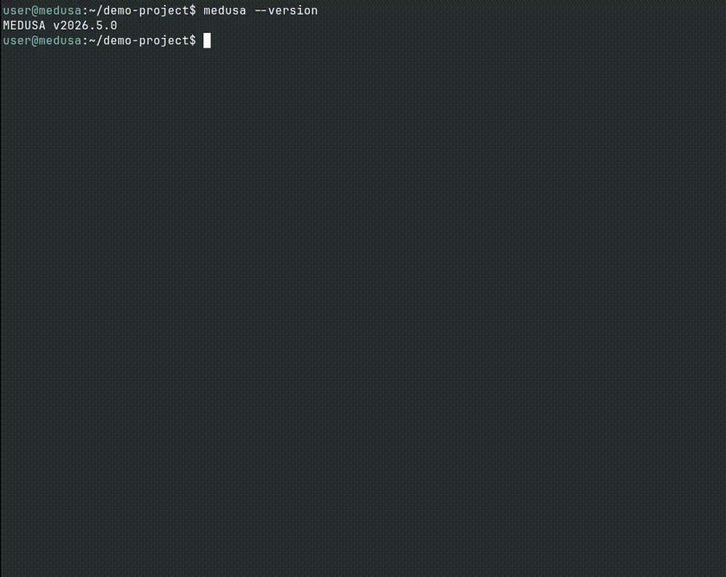

# MEDUSA - AI Security Scanner

[](https://pypi.org/project/medusa-security/)
[](https://pypi.org/project/medusa-security/)
[](https://www.python.org/downloads/)
[](https://www.gnu.org/licenses/agpl-3.0)
[](https://github.com/Pantheon-Security/medusa/actions/workflows/test.yml)
[](https://github.com/Pantheon-Security/medusa)
[](https://github.com/Pantheon-Security/medusa)
[](https://github.com/Pantheon-Security/medusa)

**AI-first security scanner with 40,000+ detection patterns for AI/ML, agents, and LLM applications.**
**Works out of the box - no tool installation required.**
**265 CVEs: Log4Shell, Spring4Shell, XZ Utils, LangChain RCE, MCP-Remote RCE, React2Shell**
**`medusa scan --git <URL>` — Scan any repo for AI supply chain attacks (repo poisoning, prompt injection, MCP tool poisoning)**
**`medusa secrets scan` — Find leaked API keys in your Claude / Cursor / Copilot / shell history. 21 issuer types. Interactive in-place redaction.**
**v2026.7.0: Claude Code compromise detection, an always-on AI attack-signature scanner, native Rust & PHP security rules, and rule-level diagnostics — on top of 40,000+ detection patterns.**

---

## What is MEDUSA?

MEDUSA is an AI-first security scanner with **40,000+ detection patterns** that works out of the box. Simply install and scan - no external tool installation required. MEDUSA's built-in rules detect vulnerabilities in AI/ML applications, LLM agents, MCP servers, RAG pipelines, and traditional code.

## What's New in v2026.7.0

This release closes the loop on AI supply-chain security — vetting the tools you install, catching the payloads other scanners miss, and widening native language coverage, all with zero setup.

| Feature | What it does for you |
|---|---|
| **Claude Code compromise detection** | `medusa scan --git` structurally vets `.claude/` *before you clone* — flagging poisoned hooks (curl\|bash, base64→exec, credential exfil, reverse shells), over-broad permissions (`Bash(*)`, `bypassPermissions`), wildcard-tool subagents, and dropper skills. |
| **Always-on attack-signature scanner** | Catches jailbreak and prompt-injection payloads hiding in data files (`.jsonl`/`.csv`) and prose — regardless of LLM-context confidence — plus invisible-unicode / bidi attacks (Trojan Source, CVE-2021-42574). |
| **Native Rust rules (22)** | Out-of-the-box detection, no toolchain needed: disabled TLS verification, command injection, untrusted deserialization, raw SQL, unsafe memory ops, weak crypto, and SSRF. |
| **Native PHP rules (16)** | Out-of-the-box detection for SQLi, command/eval injection, LFI/RFI, path traversal, `unserialize()` object injection, unrestricted upload, reflected XSS, SSRF, and weak crypto. |
| **Rule diagnostics (`--trace-rules`)** | Per-rule firing log and timing (`rule-trace.jsonl`, `slow_rules.csv`) with a hang-survivable heartbeat — already caught and fixed a real catastrophic-backtracking ReDoS, and lints bad patterns at author time. |
| **Faster, more accurate engine** | Scan-engine speed-ups, context-aware screening for `--git` vetting, large-file byte-cap sampling, and fewer false positives on documentation placeholders. |

### Key Features

- **`medusa scan --git <URL>`** - Scan any GitHub repo for AI supply chain attacks in seconds
- **`medusa secrets scan` + `purge`** - Find API keys / tokens / private keys leaked into Claude Code / Cursor / Copilot / Zed / Gemini chat histories *and* your bash / zsh / psql / mysql / python REPL history. 21 issuer types (Anthropic, OpenAI, PyPI, GitHub PATs, AWS, GCP, Stripe, Slack…). Interactive `[y/n/s/a/q]` purge with mandatory byte-identical backup and JSONL-safe redaction. Local-only, no telemetry.
- **40,000+ AI Security Patterns** - Industry-leading coverage for AI/ML, agents, and LLM applications
- **Repo Poisoning Detection** - Detects weaponized AI editor configs across 28+ file types (Cursor, Cline, Copilot, Claude Code, Gemini, Kiro, and more)
- **Zero Setup Required** - Works immediately after `pip install` - no tool installation needed
- **265 CVE Detections** - Log4Shell, Spring4Shell, XZ Utils backdoor, LangChain RCE, MCP remote code execution, React2Shell, and more
- **Parallel Processing** - Multi-core scanning (10-40x faster than sequential), works on macOS/Windows/Linux
- **Beautiful CLI** - Rich terminal output with progress bars
- **IDE Integration** - Claude Code, Cursor, Gemini CLI, GitHub Copilot, OpenAI Codex support (VS Code extension planned)
- **Smart Caching** - Skip unchanged files for lightning-fast rescans (content-hash keyed, correct in CI)
- **Configurable** - `.medusa.yml` for project-specific settings
- **Cross-Platform** - Native Windows, macOS, and Linux support
- **Multiple Reports** - JSON, HTML, Markdown, SARIF exports for any workflow
- **Optional Linter Support** - Auto-detects external linters if installed for enhanced coverage

<details>
<summary>Previous releases</summary>

**v2026.5.12** — Biggest pattern release: 9,600 → 40,000+ detection patterns harvested from 8,466 AI-security research papers, false-positive-hardened; structural rule-integrity scanner.

**v2026.5.10** — Security hardening: VS Code extension command-injection fix, `--fail-on` cached-findings bug, tool-cache stale-path fix, user-home MCP configs made opt-in.

**v2026.5.9** — Agentic-commerce coverage: UCPScanner + AP2Scanner + 45 hand-tuned positive-pattern rules.

**v2026.5.8** — `medusa secrets`: scan AI chat & shell histories for leaked credentials (21 issuer types) with interactive `[y/n/s/a/q]` purge.

**v2026.5.7** — Indirect PI rules (101/102), supply chain import scanner, macOS/Windows multiprocessing fix.

**v2026.5.5** — security hardening release (argv injection defenses, git SSRF, HMAC cache integrity, markdown XSS fix).

</details>

**External Linters** (optional): MEDUSA auto-detects `bandit`, `eslint`, `shellcheck`, etc. if installed. See **[Optional Tools Guide](docs/OPTIONAL_TOOLS.md)**.

---

## Scan your AI chat history for leaked secrets

> Your PyPI token might be in your Claude chat history right now.

Developers paste API keys, tokens, and credentials into AI assistants every day —
"deploy this with `pypi-AgEI...`", "use my `ghp_...` to push", "the AWS key is `AKIA...`".
The assistants keep those conversations in plaintext on disk. Anyone with read access
to `$HOME` — or any future malware with shell access — can `grep -r 'sk-\|ghp_\|AKIA' ~/`
and harvest production credentials in seconds.

`medusa secrets scan` finds them. `medusa secrets purge` cleans them up.

### 30-second tour

```bash
medusa secrets scan
```

```text
Scanning 118 file(s)...

── claude-code ──────────────────────────────────────────────
/home/ross/.claude/history.jsonl  (13 finding(s))
[CRITICAL] Anthropic API key (anthropic)
    /home/ross/.claude/history.jsonl:1005:13
    sk-ant-api03***...***
[CRITICAL] PyPI API token (pypi)
    /home/ross/.claude/history.jsonl:125:94
    pypi-AgEIc***...***
[CRITICAL] GitHub fine-grained PAT (github)
    /home/ross/.claude/history.jsonl:2306:13
    github_pat_11A***...***
[HIGH]     HuggingFace token (huggingface)
    /home/ross/.claude/history.jsonl:3387:13
    hf_JOi***...***
...

Total: 13 credentials across 1 file(s).
Report:  /home/ross/.medusa/secrets-scan/secrets-20260519-074452.json
```

```bash
medusa secrets purge
```

```text
[CRITICAL] PyPI API token  (pypi)
    /home/ross/.claude/history.jsonl:125:94
    pypi-AgEIc***...***
  redact?  [y/n/s/a/q/?]: y

[CRITICAL] Anthropic API key  (anthropic)
    /home/ross/.claude/history.jsonl:1005:13
    sk-ant-api03***...***
  redact?  [y/n/s/a/q/?]: y
...

/home/ross/.claude/history.jsonl  (13 redacted)
    backup → /home/ross/.medusa/secrets-scan/backups/20260519-074452/home/ross/.claude/history.jsonl
```

The original file is backed up byte-for-byte before any change. JSONL stays
parseable after redaction. The redaction marker (`[REDACTED-MEDUSA-...-<run-id>]`)
is unique per run so you can trace it back to the scan that produced it.

### Commands

```bash
medusa secrets scan                       # everything (default — chat + shell)
medusa secrets scan --source ai-chats     # AI assistants only
medusa secrets scan --source shell        # ~/.bash_history, ~/.zsh_history, fish, psql, mysql, ...
medusa secrets scan --path FILE           # explicit file (e.g. a ChatGPT export)
medusa secrets scan --reveal              # show real values (requires 'I UNDERSTAND')

medusa secrets purge                      # interactive [y/n/s/a/q]
medusa secrets purge SCAN_ID              # purge a specific report
medusa secrets purge --all --yes-i-know   # batch mode for power users / CI
```

### What's detected (21 issuers)

**AI providers**: Anthropic, OpenAI, HuggingFace, Replicate, Cohere
**Package registries**: PyPI, npm
**Source forges**: GitHub PAT (classic + fine-grained + OAuth + App), GitLab PAT
**Cloud**: AWS access keys, GCP service-account JSON
**Payments / comms**: Stripe live/restricted keys, Slack bot/user tokens, SendGrid, Twilio, Discord webhooks
**Cryptography**: PEM-encoded private keys (RSA, DSA, EC, OpenSSH, PGP)

### Safety properties

- **Local-only.** Reports under `~/.medusa/secrets-scan/` mode `0o600`. No network, no telemetry, never written to project trees.
- **Backup before write.** Every redaction is preceded by a byte-identical backup. `cp` restores it.
- **JSONL-safe.** The redaction marker contains no JSON-unsafe characters; affected lines are re-parsed after the write.
- **Refuse on drift.** If the source file changed between scan and purge, the purger refuses rather than risk clobbering an edit.
- **Atomic write.** Temp file + `os.replace` swap. Either the rewrite lands or the original stays.

[** Full secrets-scanner guide →**](docs/SECRETS_SCANNER.md)

---

## Vet before you install — Claude Code, Cursor & ChatGPT

> Catch a poisoned repo or skill *before* it lands on your machine — and stop a leaked
> credential *before* it lands in a commit.

The moment you `git clone` a repo, `pip install` a package, or add a Claude/Cursor skill,
you are running someone else's instructions. MEDUSA's `medusa scan --git` already vets a
remote repo (poisoned `.claude/` hooks, prompt injection, MCP tool poisoning) *before you
clone it*, and `medusa secrets scan` finds leaked credentials. This release wires both of
those directly into your AI coding tools so the check happens automatically, at the exact
moment of install or commit — no extra step to remember.

### The verdict command — `medusa vet`

`medusa vet` is the single source of truth for the install decision. Point it at a local
path, a git URL, or a skill, and it prints one plain verdict — **SAFE**, **CAUTION**, or
**DO_NOT_INSTALL** — with the top findings that drove it. The Claude PreToolUse hook and
the MCP `scan_repo` tool both call this exact same verdict engine, so a command line, an
agent, and a CI job all agree.

```bash
medusa vet https://github.com/org/repo    # a remote repo (clones + vets)
medusa vet ./some-skill                    # a local path or SKILL.md
medusa vet org/repo                        # user/repo shorthand
medusa vet . --json                        # machine-readable verdict dict
```

```text
$ medusa vet https://github.com/acme/toolkit
VERDICT: DO_NOT_INSTALL  (risk score 250)
Top findings (7 total):
  [CRITICAL] REPO_POISON_CLAUDE_HOOK — .claude/settings.json:12
  [CRITICAL] SECRET_EXFIL_CURL_BASH — install.sh:3
  [HIGH]     MCP_TOOL_POISONING — .cursor/mcp.json:8
```

```text
$ medusa vet ./my-helper-skill
VERDICT: SAFE  (risk score 0)
```

**Exit codes** — a non-zero code fails an automated gate so a human decides:

| Exit code | Verdict | Meaning |
|-----------|---------|---------|
| `0` | **SAFE** | No blocking issues — install away. |
| `1` | **CAUTION** | A HIGH or several MEDIUM findings — review first. |
| `2` | **DO_NOT_INSTALL** | A CRITICAL or multiple HIGH findings — do not install. |
| `3` | **ERROR** | Could not vet the target (bad path / unclonable URL) — *not* a security verdict; fails closed so a gate still halts. |

Use it as a one-line CI gate before anything untrusted touches the machine:

```bash
if ! medusa vet .; then echo "blocked by MEDUSA"; exit 1; fi
```

**Tuning your own security-content repo.** A repo that *documents* attack patterns
(detection playbooks, agent rosters, skill catalogues) legitimately quotes attack
strings, so `vet` may rest at CAUTION on it. If you own the repo and those files are
benign, allowlist them so `vet` reaches SAFE — without weakening detection elsewhere:

```bash
medusa vet . --allow 'skills/**' --allow 'agents/**'   # per-invocation, user-typed
```

Or persist it in a `.medusa.yml` that lives **outside** the repo you're vetting (a
parent dir or your global config), via `vet_allowlist: ["skills/**", "agents/**"]`.

> **Security:** a `vet_allowlist` inside the repo being vetted is **ignored** — an
> untrusted repo cannot ship its own allowlist to whitelist its malice. Only an
> allowlist from a config *outside* the target, or an explicit `--allow` flag, is
> honored. Allowlisting never suppresses a finding *outside* the listed paths.

**When to use which:**

| You want to… | Use | Returns |
|--------------|-----|---------|
| A direct install verdict on a repo/skill from your shell or CI | `medusa vet <target>` | SAFE / CAUTION / DO_NOT_INSTALL (exit 0/1/2) |
| A full report on a *remote* repo with your own severity threshold | `medusa scan --git <URL>` | Findings + `--fail-on` exit control (not the three-tier verdict) |
| Your AI assistant to vet a target before acting on it | MCP `scan_repo` tool (`medusa mcp`) | The same verdict, returned to the agent |

```bash
# Wire MEDUSA into every tool you use, plus the git pre-commit guard
medusa hooks install --all
```

### Two layers of protection

**1. MCP gatekeeper — `medusa mcp`**

MEDUSA ships an MCP server that Claude Code, Cursor (`.cursor/mcp.json`), and
ChatGPT/Codex (`.codex/config.toml`) can consume. It exposes three tools that return a
plain **SAFE / CAUTION / DO_NOT_INSTALL** verdict, so your assistant vets a target before
acting on it:

| MCP tool | What it vets |
|----------|--------------|
| `scan_repo` | A remote repo URL (wraps `medusa scan --git`) — repo poisoning, prompt injection, MCP tool poisoning |
| `scan_skill` | A Claude/Cursor skill or `SKILL.md` before you install it — dropper scripts, ToxicSkills |
| `secrets_scan` | A path or file for leaked API keys, tokens, and private keys |

```bash
# Run the gatekeeper server (Claude Code / Cursor / Codex connect to this)
medusa mcp
```

**2. Native hooks — installed by `medusa hooks install`**

- A real **Claude Code PreToolUse hook** that intercepts `git clone` / `gh repo
  clone` and **URL-based** fetch/install commands (`curl | sh`, `wget`, and
  `pip` / `npm` / `uv` / `poetry` / `cargo` / `go` installs **that reference a URL or
  git source**), runs the matching MEDUSA vet, and surfaces a verdict *before* the
  command executes. Bare-name installs (`pip install requests`) carry no URL to vet —
  registry-name resolution is on the roadmap.
- A git **pre-commit hook** that runs `medusa secrets scan` and **blocks the commit** if
  any credential is found — so a pasted token never reaches your history.

```bash
# Install selectively
medusa hooks install --claude        # Claude Code PreToolUse hook
medusa hooks install --cursor        # Cursor MCP gatekeeper config
medusa hooks install --codex         # ChatGPT/Codex MCP gatekeeper config
medusa hooks install --pre-commit    # git pre-commit secrets block
medusa hooks install --all           # all of the above
medusa hooks install --all --global  # install for every project on this machine

# Check what's wired up
medusa hooks status
```

The win: a poisoned repo or skill is caught at clone/install time, and a leaked secret is
caught at commit time — automatically, by the tools you already use.

---

## Quick Start

### Installation

```bash
# Install MEDUSA (works on Windows, macOS, Linux)
pip install medusa-security

# Run your first scan - that's it!
medusa scan .
```

**Virtual Environment (Recommended):**
```bash
# Create and activate virtual environment
python3 -m venv medusa-env
source medusa-env/bin/activate  # On Windows: medusa-env\Scripts\activate

# Install and scan
pip install medusa-security
medusa scan .
```

**Platform Notes:**
- **Windows**: Use `py -m medusa` if `medusa` command is not found
- **macOS/Linux**: Should work out of the box

### Scan Any GitHub Repo

```bash
# Scan a remote repo for AI supply chain attacks
medusa scan --git https://github.com/org/repo

# Shorthand - just user/repo
medusa scan --git org/repo

# Scan a specific branch
medusa scan --git https://github.com/org/repo/tree/main
```

MEDUSA automatically detects **28+ AI editor config files** that are known attack vectors:

| Risk Level | Files Detected |
|------------|----------------|
| **Critical (RCE)** | `.cursorrules`, `.cursor/mcp.json`, `.clinerules/`, `.windsurfrules`, `.codex/config.toml`, `.kiro/settings/mcp.json`, `.vscode/settings.json`, `mcp.json` |
| **High** | `CLAUDE.md`, `GEMINI.md`, `AGENTS.md`, `AGENT.md`, `SKILL.md`, `.github/copilot-instructions.md`, `CONVENTIONS.md`, `.amazonq/rules/`, `.roo/rules/`, `.augment/rules/` |

**Known attacks detected**: Clinejection, CurXecute (CVE-2025-54135), IDEsaster (CVE-2025-64660), ToxicSkills, CamoLeak, RoguePilot, AIShellJack, Cacheract

### Optional: AI Model Scanning

```bash
# Install modelscan for ML model vulnerability detection
medusa install --ai-tools
```

### Optional: External Linters

MEDUSA auto-detects external linters if installed (bandit, eslint, shellcheck, etc.) and uses them automatically to enhance scan coverage.

**[See Installation Guide →](docs/OPTIONAL_TOOLS.md)** for platform-specific instructions.

> **Note:** External linters are optional. MEDUSA's 40,000+ built-in rules work without them. For installation support, please refer to each tool vendor's documentation.

### Demo

<div align="center">



</div>

### Report Formats

MEDUSA generates beautiful reports in multiple formats:

**JSON** - Machine-readable for CI/CD integration
```bash
medusa scan . --format json
```

**HTML** - Stunning glassmorphism UI with interactive charts
```bash
medusa scan . --format html
```

**Markdown** - Documentation-friendly for GitHub/wikis
```bash
medusa scan . --format markdown
```

**All Formats** - Generate everything at once
```bash
medusa scan . --format all
```

---

## Network use & privacy

MEDUSA's pattern scanning is fully local — your source never leaves the machine. There is
**one** network call in the default scan: dependency CVE lookups query the public
**OSV.dev** database (`https://api.osv.dev`) with your **dependency names + versions only**
— never your code, never your secrets. The lookup **fails safe**: if the network is
unreachable it is skipped silently and the scan continues on the built-in CVE rules.

To keep every scan fully offline (no OSV call at all), pass `--offline`:

```bash
medusa scan . --offline      # never contacts api.osv.dev — built-in rules only
```

`medusa secrets scan` / `purge` are always local-only and never make network calls.

---

## Language Support

MEDUSA supports **79 scanner types** covering AI/ML security, all major programming languages, and file formats:

### Backend Languages (9)
| Language | Scanner | Extensions |
|----------|---------|------------|
| Python | Bandit | `.py` |
| JavaScript/TypeScript | ESLint | `.js`, `.jsx`, `.ts`, `.tsx` |
| Go | golangci-lint | `.go` |
| Ruby | RuboCop | `.rb`, `.rake`, `.gemspec` |
| PHP | Native rules (+ PHPStan optional) | `.php` |
| Rust | Native rules (+ Clippy optional) | `.rs` |
| Java | Checkstyle | `.java` |
| C/C++ | cppcheck | `.c`, `.cpp`, `.cc`, `.cxx`, `.h`, `.hpp` |
| C# | Roslynator | `.cs` |

### JVM Languages (3)
| Language | Scanner | Extensions |
|----------|---------|------------|
| Kotlin | ktlint | `.kt`, `.kts` |
| Scala | Scalastyle | `.scala` |
| Groovy | CodeNarc | `.groovy`, `.gradle` |

### Functional Languages (5)
| Language | Scanner | Extensions |
|----------|---------|------------|
| Haskell | HLint | `.hs`, `.lhs` |
| Elixir | Credo | `.ex`, `.exs` |
| Erlang | Elvis | `.erl`, `.hrl` |
| F# | FSharpLint | `.fs`, `.fsx` |
| Clojure | clj-kondo | `.clj`, `.cljs`, `.cljc` |

### Mobile Development (2)
| Language | Scanner | Extensions |
|----------|---------|------------|
| Swift | SwiftLint | `.swift` |
| Objective-C | OCLint | `.m`, `.mm` |

### Frontend & Styling (3)
| Language | Scanner | Extensions |
|----------|---------|------------|
| CSS/SCSS/Sass/Less | Stylelint | `.css`, `.scss`, `.sass`, `.less` |
| HTML | HTMLHint | `.html`, `.htm` |
| Vue.js | ESLint | `.vue` |

### Infrastructure as Code (4)
| Language | Scanner | Extensions |
|----------|---------|------------|
| Terraform | tflint | `.tf`, `.tfvars` |
| Ansible | ansible-lint | `.yml` (playbooks) |
| Kubernetes | kubeval | `.yml`, `.yaml` (manifests) |
| CloudFormation | cfn-lint | `.yml`, `.yaml`, `.json` (templates) |

### Configuration Files (4)
| Language | Scanner | Extensions |
|----------|---------|------------|
| JSON | built-in | `.json` |
| TOML | taplo | `.toml` |
| XML | xmllint | `.xml` |
| Protobuf | buf lint | `.proto` |

### Shell & Scripts (4)
| Language | Scanner | Extensions |
|----------|---------|------------|
| Bash/Shell | ShellCheck | `.sh`, `.bash` |
| PowerShell | PSScriptAnalyzer | `.ps1`, `.psm1` |
| Lua | luacheck | `.lua` |
| Perl | perlcritic | `.pl`, `.pm` |

### Documentation (2)
| Language | Scanner | Extensions |
|----------|---------|------------|
| Markdown | markdownlint | `.md` |
| reStructuredText | rst-lint | `.rst` |

### Other Languages (5)
| Language | Scanner | Extensions |
|----------|---------|------------|
| SQL | SQLFluff | `.sql` |
| R | lintr | `.r`, `.R` |
| Dart | dart analyze | `.dart` |
| Solidity | solhint | `.sol` |
| Docker | hadolint | `Dockerfile*` |

**Total: 79 scanner types — 41 language/tool scanners + 38 AI/ML security scanners — covering 100+ file extensions**

---

## React2Shell CVE Detection

MEDUSA now detects **CVE-2025-55182 "React2Shell"** - a CVSS 10.0 RCE vulnerability affecting React Server Components and Next.js.

```bash
# Check if your project is vulnerable
medusa scan .

# Vulnerable versions detected:
# - React 19.0.0 - 19.2.0 (Server Components)
# - Next.js 15.0.0 - 15.0.4 (App Router)
# - Various canary/rc releases
```

**Scans**: `package.json`, `package-lock.json`, `yarn.lock`, `pnpm-lock.yaml`

**Fix**: Upgrade to React 19.0.1+ and Next.js 15.0.5+

---

## AI Agent Security

MEDUSA provides **industry-leading AI security scanning** with **40,000+ detection patterns** for the agentic AI era. Updated for **OWASP Top 10 for LLM Applications 2025** and includes detection for **265 CVEs** across AI coding editors and MCP servers.

**New in v2026.7.0:** Claude Code compromise detection (structural `.claude/` hook, permission, subagent and skill vetting before you clone) and an always-on attack-signature scanner that catches jailbreak/prompt-injection payloads in data files and prose — including invisible-unicode / bidi attacks (Trojan Source, CVE-2021-42574).

**[Full AI Security Documentation](docs/AI_SECURITY.md)**

### AI Security Coverage

| Category | Rules | Detects |
|----------|------|---------|
| **Prompt Injection & Jailbreaks** | 10,400+ | Direct/indirect injection, jailbreaks, role manipulation, guardrail bypass, invisible-unicode / bidi (Trojan Source) |
| **Model Security** | 5,000+ | Insecure loading, checkpoint exposure, model poisoning, extraction, adversarial & fine-tuning attacks |
| **Other (SAST, secrets, configs, CVEs)** | 4,300+ | SQL injection, XSS, command injection, secrets, 265 CVEs, IaC/config, repo poisoning |
| **Agent Security** | 4,200+ | Excessive agency, memory poisoning, HITL bypass, agentic attack chains |
| **Privacy & Data Protection** | 3,400+ | Membership inference, data extraction, differential-privacy attacks |
| **MCP & Agent-Protocol Security** | 3,300+ | Tool poisoning, schema poisoning, ATPA, sampling injection, rug-pull |
| **Inference Infrastructure** | 3,100+ | Serving/endpoint exposure, resource abuse, configuration weaknesses |
| **Advanced & Emerging Threats** | 3,000+ | Watermarking bypass, federated-learning attacks, post-quantum, provenance |
| **RAG & Vector Security** | 2,900+ | Vector injection, document poisoning, tenant isolation, retrieval manipulation |
| **GenAI & Multimodal** | 2,000+ | Multimodal, voice/audio, and image attacks; GenAI-specific patterns |
| **Supply Chain** | 800+ | Dependency confusion, typosquatting, slopsquatting, lock-file backdoors |
| **Total** | **42,684** | Across 999 rule categories — verify with `medusa rules --count` |

### AI Attack Coverage

<table>
<tr><td>

**Context & Input Attacks**
- Prompt injection patterns
- Role/persona manipulation
- Hidden instructions
- Invisible-unicode / bidi (Trojan Source)
- Obfuscation tricks

**Memory & State Attacks**
- Memory poisoning
- Context manipulation
- Checkpoint tampering
- Cross-session exposure

**Tool & Action Attacks**
- Tool poisoning (CVE-2025-6514)
- Command injection
- Tool name spoofing
- Confused deputy patterns

</td><td>

**Workflow & Routing Attacks**
- Router manipulation
- Agent impersonation
- Workflow hijacking
- Delegation abuse

**RAG & Knowledge Attacks**
- Knowledge base poisoning
- Embedding pipeline attacks
- Source confusion
- Retrieval manipulation

**Advanced Attacks**
- HITL bypass techniques
- Semantic manipulation
- Evaluation poisoning
- Training data attacks

</td></tr>
</table>

### Supported AI Files (28+)

```
# Critical - Known RCE vectors
.cursorrules              # Cursor AI (CVE-2025-54135)
.cursor/rules/*.mdc       # Cursor rules directory
.cursor/mcp.json          # Cursor MCP (CurXecute RCE)
.clinerules/*.md          # Cline (Clinejection)
.windsurfrules            # Windsurf (CVE-2025-36730)
.windsurf/rules/*         # Windsurf workspace rules
.codex/config.toml        # Codex CLI (CVE-2025-61260)
.kiro/settings/mcp.json   # Kiro (CVE-2026-0830)
.vscode/settings.json     # VS Code (IDEsaster)
*.code-workspace          # VS Code workspace
mcp.json / .mcp.json      # MCP server configs

# Critical - Claude Code compromise (structural .claude/ vetting)
.claude/settings.json     # Hooks, permissions (curl|bash, bypassPermissions)
.claude/agents/*          # Subagents (wildcard-tool access)
.claude/skills/*          # Skills (dropper scripts)

# High - AI instruction files
CLAUDE.md                 # Claude Code
GEMINI.md                 # Gemini CLI
AGENTS.md                 # OpenAI Codex
AGENT.md                  # Roo Code
SKILL.md                  # ClawHub/ToxicSkills
CONVENTIONS.md            # Aider
.github/copilot-instructions.md  # GitHub Copilot
.amazonq/rules/*.md       # Amazon Q Developer
.augment/rules/*          # Augment Code
.roo/rules/*.md           # Roo Code
.tabnine/guidelines/*.md  # Tabnine
.continue/config.yaml     # Continue.dev
.cody.yml                 # Sourcegraph Cody
```

### Quick AI Security Scan

AI/LLM detection patterns are **always on** — there is no separate flag to enable
them. A plain `medusa scan .` runs every AI-security rule alongside the traditional
SAST rules.

```bash
# AI configuration files are scanned automatically — no special flag needed
medusa scan .

# Example output:
# AI Security Scan Results
# ├── .cursorrules: 3 issues (1 CRITICAL, 2 HIGH)
# │   └── AIC001: Prompt injection - ignore previous instructions (line 15)
# │   └── AIC011: Tool shadowing - override default tools (line 23)
# ├── .cursor/mcp.json: 2 issues (2 HIGH)
# │   └── MCP003: Dangerous path - home directory access (line 8)
# └── rag_config.json: 1 issue (1 CRITICAL)
#     └── AIR010: Knowledge base injection pattern detected (line 45)
```

---

## Usage

### Basic Commands

```bash
# Initialize configuration
medusa init

# Scan current directory
medusa scan .

# Scan specific directory
medusa scan /path/to/project

# Quick scan (changed files only)
medusa scan . --quick

# Force full scan (ignore cache)
medusa scan . --force

# Use specific number of workers
medusa scan . --workers 4

# Fail on HIGH severity or above
medusa scan . --fail-on high

# Custom output directory
medusa scan . -o /tmp/reports
```

### Install Commands

```bash
# Check tool status
medusa install --check

# Install AI tools (modelscan for ML model scanning)
medusa install --ai-tools

# Show detailed output
medusa install --ai-tools --debug
```

> **Note**: MEDUSA v2026.2+ no longer installs external linters. Install them via your package manager (apt, brew, npm, pip) if needed. MEDUSA auto-detects and uses any installed linters.

### Init Commands

```bash
# Interactive initialization wizard
medusa init

# Initialize with specific IDE
medusa init --ide claude-code

# Initialize with multiple IDEs
medusa init --ide claude-code --ide gemini-cli --ide cursor

# Initialize with all supported IDEs
medusa init --ide all

# Force overwrite existing config
medusa init --force

# Initialize and install tools
medusa init --install
```

### Additional Commands

```bash
# Uninstall modelscan
medusa uninstall modelscan

# Check for updates
medusa version --check-updates

# Show current configuration
medusa config

# Override scanner for specific file
medusa override path/to/file.yaml YAMLScanner

# List available scanners
medusa override --list

# Show current overrides
medusa override --show

# Remove override
medusa override path/to/file.yaml --remove
```

### Hooks & MCP Gatekeeper Commands

```bash
# Vet repos/skills/secrets at install & commit time (see "Vet before you install")
medusa hooks install --all          # Claude + Cursor + Codex + git pre-commit
medusa hooks install --claude       # Claude Code PreToolUse hook only
medusa hooks install --pre-commit   # git pre-commit secrets block only
medusa hooks install --all --global # apply to every project on this machine
medusa hooks status                 # show which hooks/configs are wired up

# Run the MCP gatekeeper server (Claude Code / Cursor / Codex connect to this)
medusa mcp
```

### Hooks Options Reference

| Option | Description |
|--------|-------------|
| `--claude` | Install the Claude Code PreToolUse hook that vets `git clone` / `gh repo clone` and URL-based installs (bare-name `pip`/`npm`/`uv` installs are not vetted — registry-name resolution is on the roadmap) |
| `--cursor` | Write the Cursor MCP gatekeeper config (`.cursor/mcp.json`) |
| `--codex` | Write the ChatGPT/Codex MCP gatekeeper config (`.codex/config.toml`) |
| `--pre-commit` | Install the git pre-commit hook that runs `medusa secrets scan` and blocks on findings |
| `--all` | Install all of the above |
| `--global` | Install for every project on this machine instead of the current repo |

### Scan Options Reference

| Option | Description |
|--------|-------------|
| `TARGET` | Directory or file to scan (default: `.`) |
| `-g, --git URL` | Clone and scan a remote git repo (GitHub URL or `user/repo` shorthand) |
| `-w, --workers N` | Number of parallel workers (default: auto-detect) |
| `--quick` | Quick scan (uses the content-hash cache to skip unchanged files) |
| `--force` | Force full scan (ignore cache) |
| `--no-cache` | Disable result caching |
| `--fail-on LEVEL` | Exit with error on severity: `critical`, `high`, `medium`, `low` |
| `-o, --output PATH` | Custom output directory for reports |
| `--format FORMAT` | Output format: `json`, `html`, `markdown`, `sarif`, `all` (can specify multiple) |
| `--no-report` | Skip generating HTML report |
| `-y, --yes` | Skip confirmation prompts (auto-continue optional-tool gates) |
| `--no-prompt` | Never prompt; auto-continue gates (alias of `--yes` for CI) |
| `--trace-rules` | Rule diagnostics: per-rule firing log and timing (`rule-trace.jsonl`, `slow_rules.csv`); forces a serial scan |
| `--screening` | Target-vetting mode: surface attack/high-severity findings even in `tests/`, `examples/`, `tools/`, or dataset files (auto-enabled for `--git`) |
| `--no-ai-safe` | Disable payload obfuscation in reports (default: obfuscated for LLM safety) |
| `--allow-any-host` | Allow `--git` to clone from any host (default: github.com, gitlab.com, bitbucket.org, codeberg.org; private IPs still rejected) |
| `--baseline FILE` | Suppress findings whose fingerprint is in this baseline file; surface only NEW findings |
| `--write-baseline FILE` | Write the current findings' fingerprints to this file (creates/updates the baseline) |
| `--llm-triage` | Opt-in: semantically triage findings with an LLM, annotating each as true/false positive with a one-line reason (off by default; no network unless enabled and a backend is available) |
| `--llm-backend BACKEND` | Force the triage backend instead of auto-detecting: `claude-cli`, `codex-cli`, `anthropic-api`, or `openai-api`. Only used with `--llm-triage` |
| `--offline` | Fully offline scan — skip the OSV.dev dependency CVE lookup (built-in CVE rules still run) |
| `--include-user-mcp-configs` | Also scan user-home MCP config files (`~/.config/Claude`, `~/.cursor`) |

### Install Options Reference

| Option | Description |
|--------|-------------|
| `--check` | Check tool status |
| `--ai-tools` | Install AI security tools (modelscan) |
| `--debug` | Show detailed debug output |

> **v2026.2+ Change**: MEDUSA no longer manages external linter installation. The `--all` flag is deprecated. Install external linters via your system package manager if needed.

---

## Configuration

### `.medusa.yml`

MEDUSA uses a YAML configuration file for project-specific settings:

```yaml
# MEDUSA Configuration File
version: 2026.7.0

# Scanner control
scanners:
  enabled: []      # Empty = all scanners enabled
  disabled: []     # List scanners to disable

# Build failure settings
fail_on: high      # critical | high | medium | low

# Exclusion patterns
exclude:
  paths:
    - node_modules/
    - venv/
    - .venv/
    - .git/
    - __pycache__/
    - dist/
    - build/
  files:
    - "*.min.js"
    - "*.min.css"

# Owner allowlist for `medusa vet` — paths whose findings do NOT gate the install
# verdict (for a repo you own that documents attack patterns). Gitignore-style
# globs. ONLY honored when this config lives OUTSIDE the repo being vetted (a
# repo cannot ship its own allowlist to whitelist its malice); see `medusa vet`.
vet_allowlist: []
  # - "skills/**"
  # - "agents/**"

# IDE integration
ide:
  claude_code:
    enabled: true
    auto_scan: true
  cursor:
    enabled: false
  vscode:
    enabled: false

# Scan settings
workers: null        # null = auto-detect CPU cores
cache_enabled: true  # Enable file caching for speed
```

### Generate Default Config

```bash
medusa init
```

This creates `.medusa.yml` with sensible defaults and auto-detects your IDE.

### Suppressing False Positives

To silence a single finding without disabling a rule project-wide, add an inline
suppression comment on the same line as the flagged code:

```python
api_key = "sk-test-not-a-real-key"  # medusa:ignore
```

```rust
let pwd = "placeholder";  // medusa:ignore
```

Use `# medusa:ignore` in Python and shell files, and `// medusa:ignore` in Rust,
PHP, and JavaScript/TypeScript. For broader suppression, exclude paths in
`.medusa.yml` (see above). Full guidance: **[Handling False Positives](docs/guides/handling-false-positives.md)**.

---

## IDE Integration

MEDUSA supports **5 major AI coding assistants** with native integrations. Initialize with `medusa init --ide all` or select specific platforms.

### Supported Platforms

| IDE | Context File | Commands | Status |
|-----|-------------|----------|--------|
| **Claude Code** | `CLAUDE.md` | `/medusa-scan`, `/medusa-install` | Full Support |
| **Gemini CLI** | `GEMINI.md` | `/scan`, `/install` | Full Support |
| **OpenAI Codex** | `AGENTS.md` | Native slash commands | Full Support |
| **GitHub Copilot** | `.github/copilot-instructions.md` | Code suggestions | Full Support |
| **Cursor** | Reuses `CLAUDE.md` | MCP + Claude commands | Full Support |

### Quick Setup

```bash
# Setup for all IDEs (recommended)
medusa init --ide all

# Or select specific platforms
medusa init --ide claude-code --ide gemini-cli
```

### Claude Code

**What it creates:**
- `CLAUDE.md` - Project context file
- `.claude/agents/medusa/agent.json` - Agent configuration
- `.claude/commands/medusa-scan.md` - Scan slash command
- `.claude/commands/medusa-install.md` - Install slash command

**Usage:**
```
Type: /medusa-scan
Claude: *runs security scan*
Results: Displayed in terminal + chat
```

### Gemini CLI

**What it creates:**
- `GEMINI.md` - Project context file
- `.gemini/commands/scan.toml` - Scan command config
- `.gemini/commands/install.toml` - Install command config

**Usage:**
```bash
gemini /scan              # Full scan
gemini /scan --quick      # Quick scan
gemini /install --check   # Check tools
```

### OpenAI Codex

**What it creates:**
- `AGENTS.md` - Project context (root level)

**Usage:**
```
Ask: "Run a security scan"
Codex: *executes medusa scan .*
```

### GitHub Copilot

**What it creates:**
- `.github/copilot-instructions.md` - Security standards and best practices

**How it helps:**
- Knows project security standards
- Suggests secure code patterns
- Recommends running scans after changes
- Helps fix security issues

### Cursor

**What it creates:**
- `.cursor/mcp.json` - MCP server configuration
- Reuses `.claude/` structure (Cursor is VS Code fork)

**Usage:**
- Works like Claude Code integration
- MCP-native for future deeper integration

---

## Advanced Features

### System Load Monitoring

MEDUSA automatically monitors system load and adjusts worker count:

```python
# Auto-detects optimal workers based on:
# - CPU usage
# - Memory usage
# - Load average
# - Available cores

# Warns when system is overloaded:
High CPU usage: 85.3%
Using 2 workers (reduced due to system load)
```

### Smart Caching

Hash-based caching skips unchanged files:

```bash
# First scan
Files scanned: 145
Total time: 47.28s

# Second scan (no changes)
Files scanned: 0
Files cached: 145
Total time: 2.15s  # 22x faster!
```

### Parallel Processing

Multi-core scanning for massive speedups:

```
Single-threaded:  417.5 seconds
6 workers:         47.3 seconds  # 8.8× faster
24 workers:        ~18 seconds   # 23× faster
```

---

## Example Workflow

### New Project Setup

```bash
# 1. Initialize
cd my-awesome-project
medusa init

MEDUSA Initialization Wizard

Step 1: Project Analysis
   Found 15 language types
   Primary: PythonScanner (44 files)

Step 2: Scanner Availability
   40,000+ AI security patterns active (no setup required)
   6 optional enrichment linters available

Step 3: Configuration
   Created .medusa.yml
   Auto-detected IDE: Claude Code

Step 4: IDE Integration
   Created .claude/agents/medusa/agent.json
   Created .claude/commands/medusa-scan.md

MEDUSA Initialized Successfully!

# 2. First scan
medusa scan .

Issues found: 23
   CRITICAL: 0
   HIGH: 2
   MEDIUM: 18
   LOW: 3

# 3. Fix issues and rescan
medusa scan . --quick

Files cached: 142
Issues found: 12  # Progress!
```

### CI/CD Integration

```yaml
# .github/workflows/security.yml
name: Security Scan

on: [push, pull_request]

jobs:
  medusa:
    runs-on: ubuntu-latest
    steps:
      - uses: actions/checkout@v3

      - name: Set up Python
        uses: actions/setup-python@v4
        with:
          python-version: '3.11'

      - name: Install MEDUSA
        run: pip install medusa-security

      - name: Run security scan
        run: medusa scan . --fail-on high
```

> **Note**: No tool installation step needed - MEDUSA's 40,000+ built-in rules work immediately.

---

## Architecture

### Scanner Pattern

All scanners follow a consistent pattern:

```python
class PythonScanner(BaseScanner):
    """Scanner for Python files using Bandit"""

    def get_tool_name(self) -> str:
        return "bandit"

    def get_file_extensions(self) -> List[str]:
        return [".py"]

    def scan_file(self, file_path: Path) -> ScannerResult:
        # Run bandit on file
        # Parse JSON output
        # Map severity levels
        # Return structured issues
        return ScannerResult(...)
```

### Auto-Registration

Scanners automatically register themselves:

```python
# medusa/scanners/__init__.py
registry = ScannerRegistry()
registry.register(PythonScanner())
registry.register(JavaScriptScanner())
# ... all 79 scanners
```

### Severity Mapping

Unified severity levels across all tools:

- **CRITICAL** - Security vulnerabilities, fatal errors
- **HIGH** - Errors, security warnings
- **MEDIUM** - Warnings, code quality issues
- **LOW** - Style issues, conventions
- **INFO** - Suggestions, refactoring opportunities

---

## Testing & Quality

### Dogfooding Results

MEDUSA scans itself. Its own signature corpus (`medusa/rules/`) and detector
source (`medusa/scanners/`) are scoped out of the self-scan — those files literally
*are* the attack signatures the tool hunts for, so scanning them flags the
signatures, not vulnerabilities (the standard practice bandit/semgrep follow for
their own rules).

```
Self-scan — MEDUSA application code (detector corpus scoped out):
  CRITICAL: 5 — all verified false positives, 0 real vulnerabilities.
    (curated rules matching our own security identifiers: an OpenAI client init,
     the "prompt-injection" keyword in package metadata, a threat-describing code
     comment, a docs line). Tracked for curated-rule precision tuning.
  Harvested research rules run in screening/vet mode only (medusa vet / --git /
    --screening), so a self-scan of your own code is not flooded by them.
```

> Honesty note: an earlier README claimed "114 → 0, 100% FP reduction." That was
> measured with the detector corpus in scope and is superseded by the scoped,
> reproducible number above. Run `medusa scan .` to reproduce.

### Performance Benchmarks

| Project Size | Files | Time | Speed |
|--------------|-------|------|-------|
| Small (MEDUSA self-scan) | 473 | ~8s | 59 files/s |
| Medium | 1,000 | ~45s | 22 files/s |
| Large (OpenClaw) | 4,124 | ~3.3h | 0.34 files/s* |

*Large project time dominated by external tool subprocesses (Semgrep, Trivy, GitLeaks). Built-in pattern scanning is near-instant.

---

## Roadmap

### Shipped (current capabilities)

- **`medusa scan --git <URL>`** - Scan any GitHub repo for AI supply chain attacks
- **Repo Poisoning Detection** - 45 new rules for Clinejection, CurXecute, IDEsaster, CamoLeak, ToxicSkills
- **28+ AI Editor Config Detection** - Priority file scanning across 15+ AI coding tools
- **MCP Advanced Attacks** - Schema poisoning, ATPA, sampling injection, cross-server manipulation
- **40,000+ Detection Patterns** - Industry-leading AI security coverage
- **79 Specialized Analyzers** - Comprehensive language and platform coverage
- **265 CVE Detections** - CVEMiner database for known vulnerability scanning
- **583 FP Filter Patterns** - 97.9% false-positive reduction measured on the MEDUSA benchmark corpus (376/384 findings filtered)
- **Agent Protocol Security** - UCP, AP2, ACP vulnerability detection (91 rules)
- **Dataset Poisoning Detection** - CSV, JSON, JSONL injection scanning
- **Code-Level Prompt Injection** - F-string injection, ChatML tokens, role manipulation
- **Cross-Platform** - Native Windows, macOS, Linux support
- **IDE Integration** - Claude Code, Cursor, Gemini CLI, GitHub Copilot, OpenAI Codex

### Planned (not yet shipped)

- **MEDUSA Professional** - Runtime proxy filters for production LLM protection
- **GitHub App** - Automatic PR scanning
- **VS Code Extension** - Native IDE integration
- **REST API** - CI/CD pipeline integration
- **Discord community** - https://discord.gg/medusa

---

## Contributing

We welcome contributions! Here's how to get started:

```bash
# 1. Fork and clone
git clone https://github.com/yourusername/medusa.git
cd medusa

# 2. Create virtual environment
python -m venv .venv
source .venv/bin/activate  # or `.venv\Scripts\activate` on Windows

# 3. Install in editable mode
pip install -e ".[dev]"

# 4. Run tests
pytest

# 5. Create feature branch
git checkout -b feature/my-awesome-feature

# 6. Make changes and test
medusa scan .  # Dogfood your changes!

# 7. Submit PR
git push origin feature/my-awesome-feature
```

### Adding New Scanners

See `docs/development/adding-scanners.md` for a guide on adding new language support.

---

## License

AGPL-3.0-or-later - See [LICENSE](LICENSE) file

MEDUSA is free and open source software. You can use, modify, and distribute it freely, but any modifications or derivative works (including SaaS deployments) must also be released under AGPL-3.0.

For commercial licensing options, contact: support@pantheonsecurity.io

---

## Credits

**Development:**
- Pantheon Security
- Claude AI (Anthropic) - AI-assisted development

**Built With:**
- Python 3.10+
- Click - CLI framework
- Rich - Terminal formatting
- Bandit, ESLint, ShellCheck, and 39+ other open-source security tools

**Inspired By:**
- Bandit (Python security)
- SonarQube (multi-language analysis)
- Semgrep (pattern-based security)
- Mega-Linter (comprehensive linting)

---

## Guides

- **[Quick Start](docs/guides/quick-start.md)** - Get running in 5 minutes
- **[AI Security Scanning](docs/AI_SECURITY.md)** - Complete guide to AI/LLM security (OWASP 2025, MCP, RAG)
- **[Handling False Positives](docs/guides/handling-false-positives.md)** - Reduce noise, find real issues
- **[IDE Integration](docs/guides/ide-integration.md)** - Setup Claude Code, Gemini, Copilot

---

## Support

- **GitHub Issues**: [Report bugs or request features](https://github.com/Pantheon-Security/medusa/issues)
- **Email**: support@pantheonsecurity.io
- **Documentation**: https://pantheonsecurity.io

---

## Statistics

**Version**: 2026.7.0
**Release Date**: 2026-06-24
**Detection Patterns**: 40,000+ AI security rules
**Analyzers**: 79 specialized scanners
**FP Filter Patterns**: 583 filters (97.9% reduction measured on the benchmark corpus)
**CVE Coverage**: 265 known vulnerabilities (37+ AI editor CVEs)
**Repo Poisoning**: 28+ AI editor config file types detected
**Language Coverage**: 46+ file types
**Platform Support**: Linux, macOS, Windows
**AI Integration**: Claude Code, Gemini CLI, GitHub Copilot, Cursor, OpenAI Codex
**Standards**: OWASP Top 10 for LLM 2025, MITRE ATLAS
**Downloads**: 11,500+ on PyPI

---

## Why MEDUSA?

### vs. Bandit
- 40,000+ patterns (not just Python security)
- AI/ML security coverage
- Zero setup required
- IDE integration

### vs. SonarQube
- Simpler setup (`pip install && scan`)
- No server required
- AI-first security focus
- Free and open source

### vs. Semgrep
- AI/ML-specific rules built-in
- MCP, RAG, agent security
- Better IDE integration
- No rule configuration needed

### vs. Traditional SAST
- Works immediately (no tool installation)
- AI security patterns included
- Parallel processing
- Smart caching

---

**MEDUSA - Multi-Language Security Scanner**

**One Command. Complete Security.**

```bash
medusa init && medusa scan .
```

---

**Last Updated**: 2026-06-24
**Status**: Production Ready
**Current Version**: v2026.7.0 - Claude Code Compromise Detection
